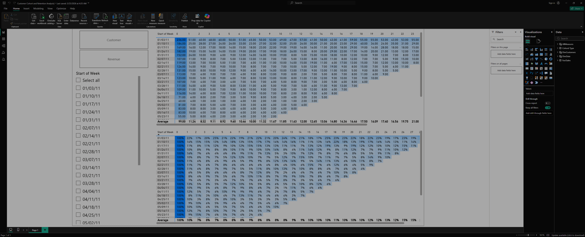

# Customer Cohort and Retention Analysis Dashboard

## Business Task
Create a reporting dashboard to perform cohort analysis on online retail data, tracking customer retention rates and revenue generation over time to measure long-term user engagement.

## Tools Used
- Power BI
- Excel

## Key Features
- Interactive toggle buttons to switch analysis between Customer count and Revenue metrics
- Cohort performance matrix tracking absolute metrics over weeks since the first transaction
- Retention rate heatmap visualizing the percentage of returning customers over time
- Dimensional data modeling (Fact and Dim tables) with custom DAX measures for complex cohort calculations
- Slicer for filtering specific cohort start weeks

## Result
The report enables users to identify retention trends, evaluate the long-term value of specific customer cohorts, and monitor overall revenue stability. 
This report simulates a typical growth and customer success analytics task.
