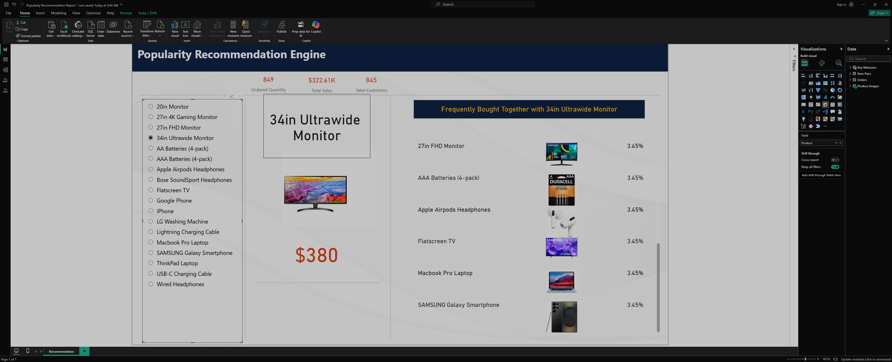

# Popularity Recommendation Dashboard

## Business Task
Create a reporting dashboard to perform market basket analysis on sales data, 
identifying products frequently bought together to support cross-selling strategies.

## Tools Used
- Power BI
- CSV

## Key Features
- Interactive product slicer for dynamic selection
- Key metrics cards displaying ordered quantity, total sales, and unique customers
- Recommendation matrix showing companion products, images, and joint purchase probabilities
- Custom DAX measures for calculating cross-sell percentages

## Result
The report enables users to identify cross-selling opportunities, explore product affinities, 
and understand customer purchasing behavior. 
This report simulates a typical e-commerce market basket analysis task.
