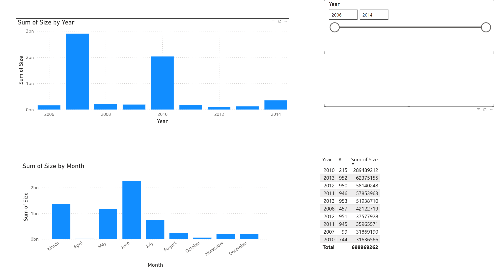

# CDs Sales Reporting Dashboard

## Business Task
Create a reporting dashboard to analyze CD data by creation date and size,
supporting exploration and comparison across different time periods.

## Tools Used
- Power BI
- Excel

## Key Features
- Table summarizing year, record number, and total size
- Stacked column charts by year and by month
- Top 10 filtering by total size
- Interactive year slicer
- Bookmarks for different year ranges

## Result
The report enables users to explore trends, compare time periods,
and focus on the most significant records.
This report simulates a typical operational reporting task.
